# React Native & Laravel Starter Kit

A production-ready mobile starter kit for building apps with **React Native (Expo)**, **Gluestack UI v3**, **NativeWind (Tailwind CSS)**, and a **Laravel Sanctum** backend.

## Screenshots

### Light Mode

| Welcome | Sign In | Sign Up | Forget Password | Dashboard |
|:---:|:---:|:---:|:---:|:---:|
| 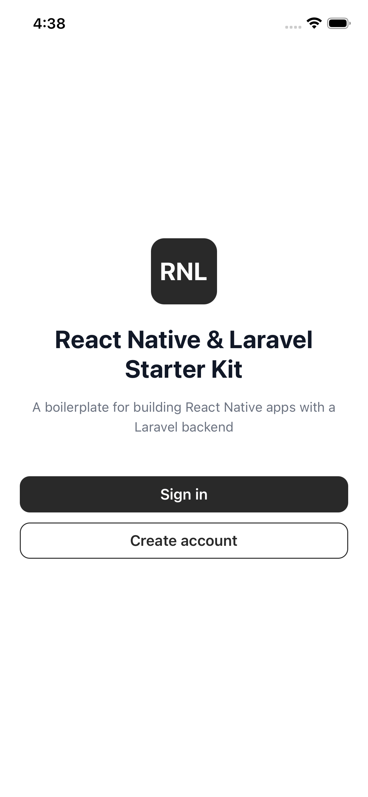 | 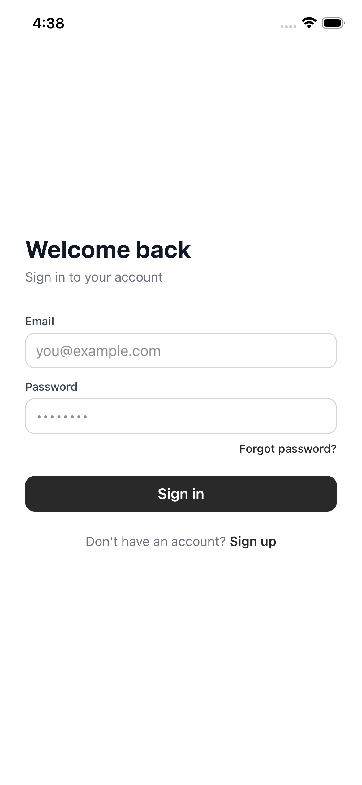 | 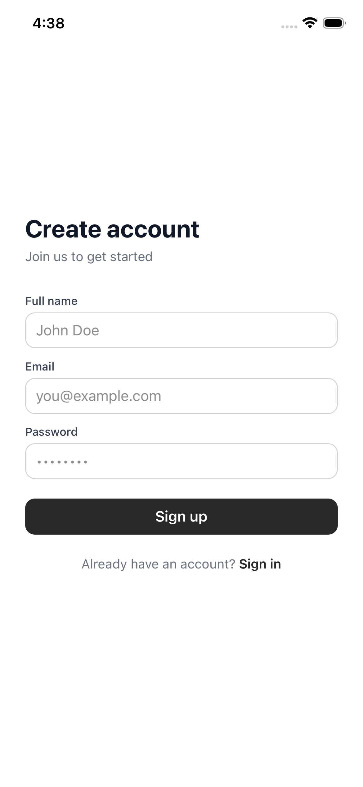 | 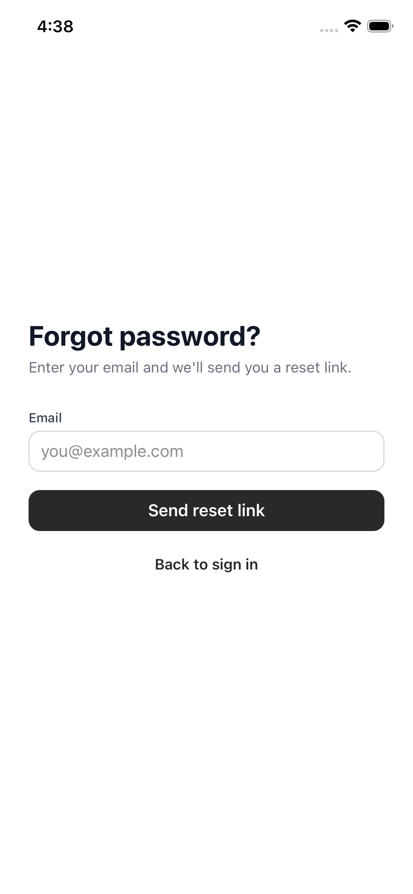 | 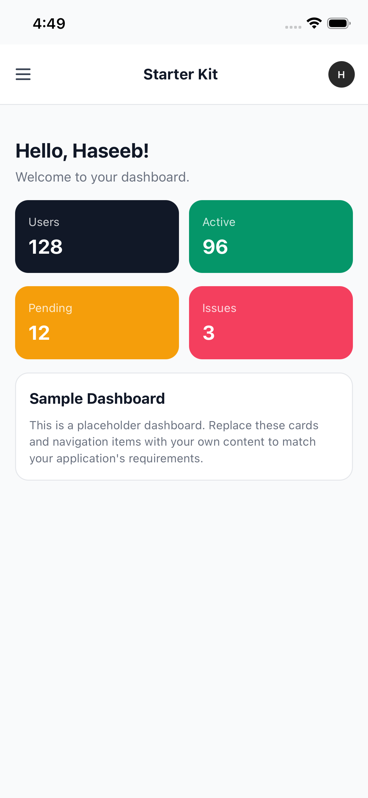 |

| Drawer | Profile | Edit Profile | Settings |
|:---:|:---:|:---:|:---:|
| 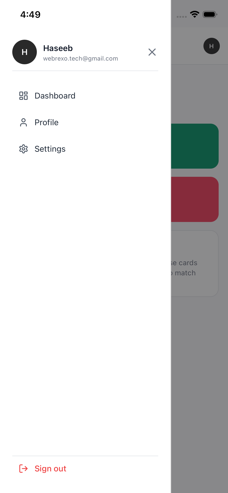 | 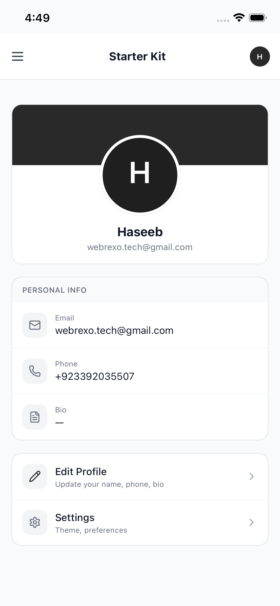 | 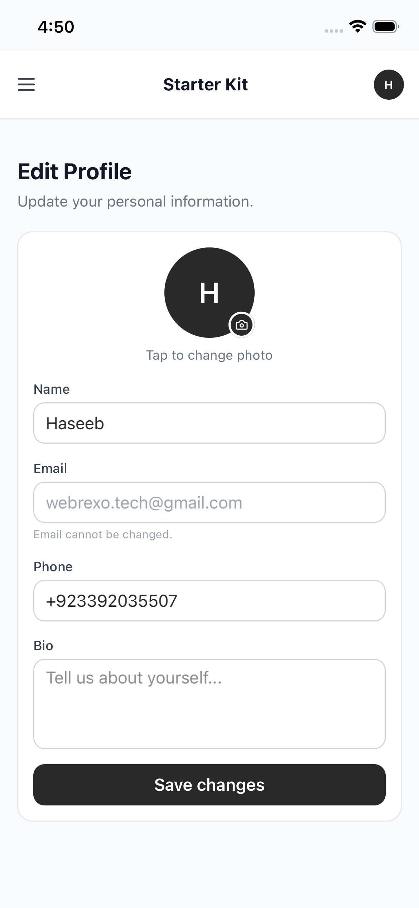 | 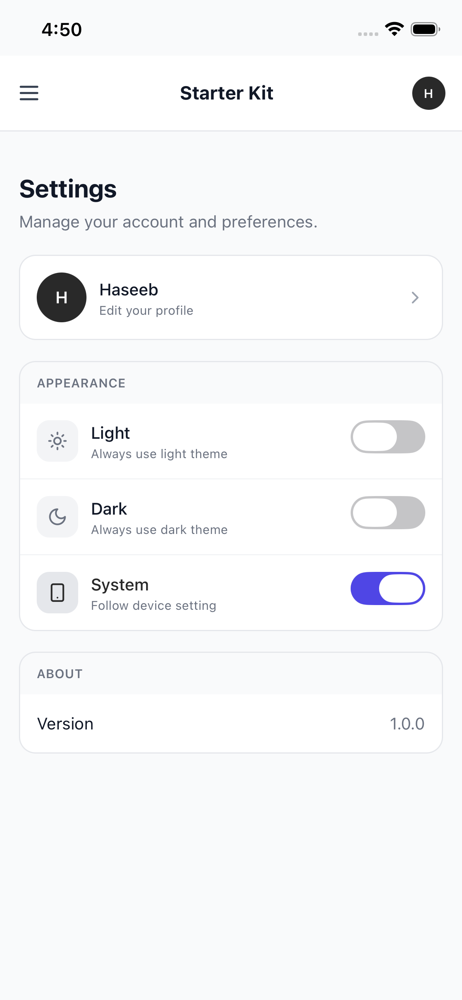 |

### Dark Mode

| Welcome | Sign In | Sign Up | Forget Password | Dashboard |
|:---:|:---:|:---:|:---:|:---:|
| 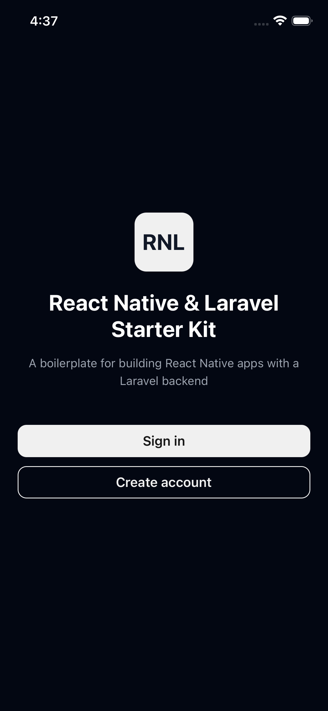 | 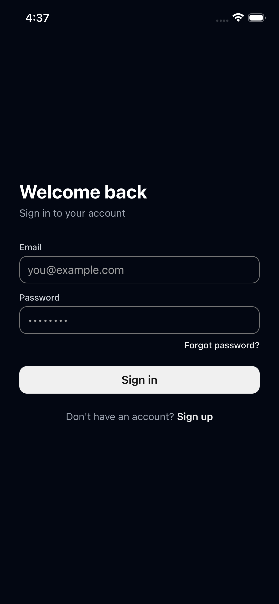 | 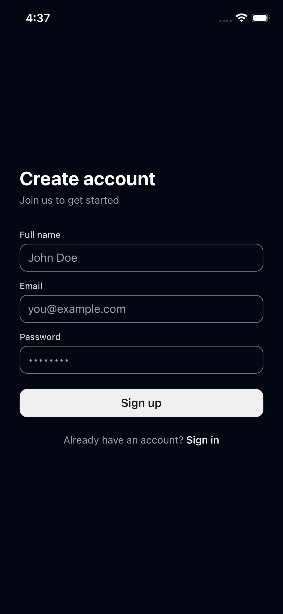 | 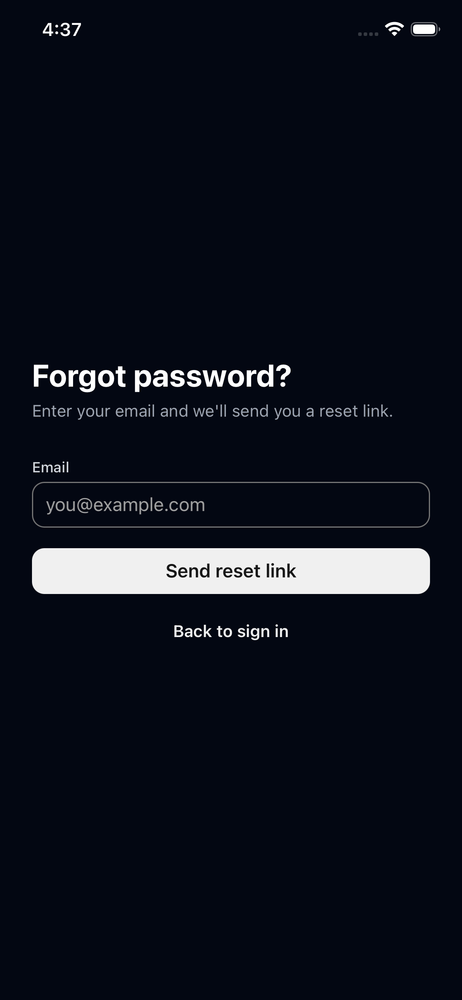 | 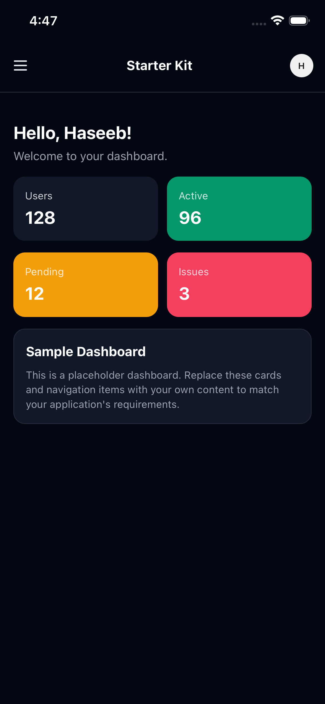 |

| Drawer | Profile | Edit Profile | Settings |
|:---:|:---:|:---:|:---:|
| 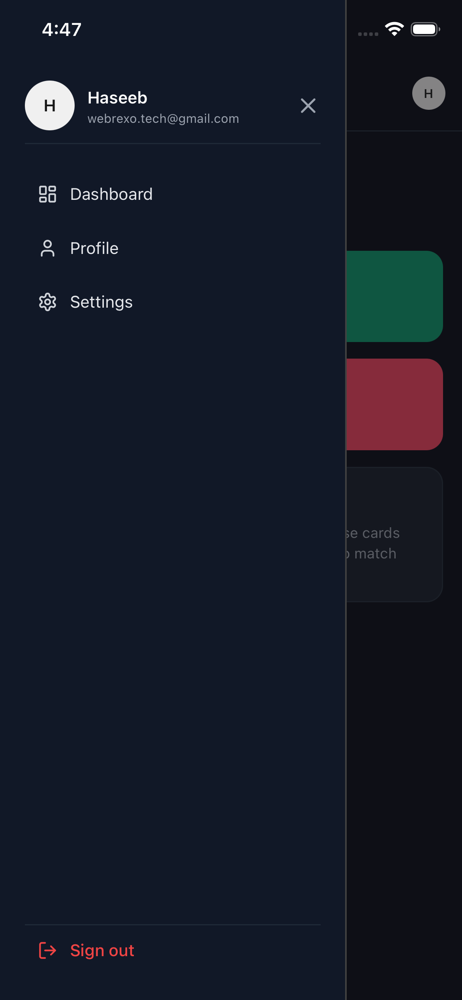 | 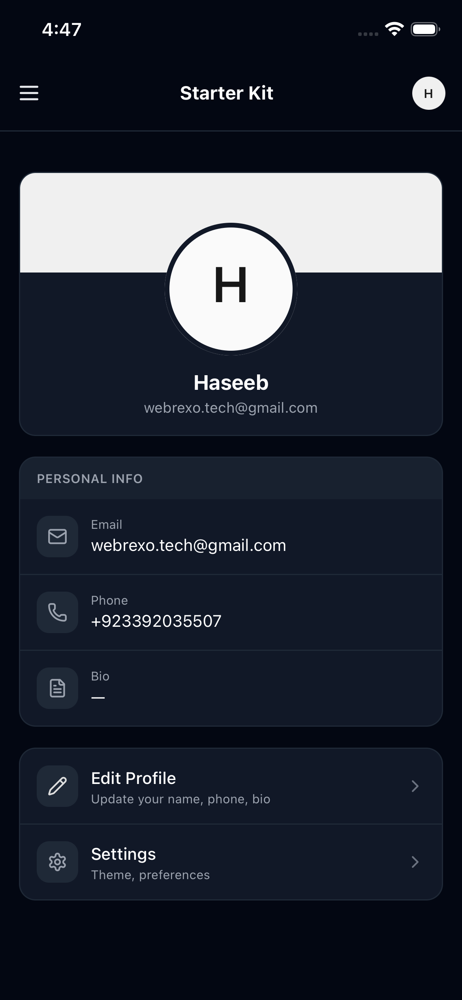 | 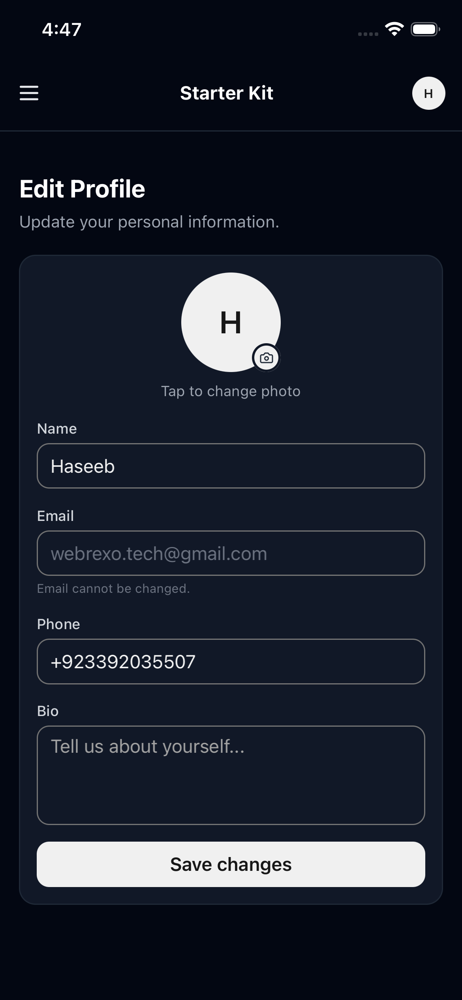 | 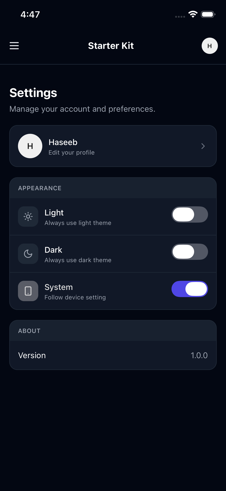 |

## Features

- **Auth flow** — Sign in, Sign up, Forgot password, Reset password (Laravel Sanctum bearer-token auth)
- **Persistent sessions** — Token stored via AsyncStorage; auto-restore on launch with loading screen, auto-logout on 401
- **Profile** — Read-only profile display with cover banner, avatar, and personal info
- **Edit Profile** — Dedicated form to update name, phone, and bio (posts to `/profile`)
- **Settings** — Light / Dark / System theme toggle, persisted via AsyncStorage
- **Axios API client** — Centralized client with automatic `Authorization` header injection
- **Gluestack UI v3** — CLI-installed components under `components/ui/` (Button, Input, Drawer, Avatar, Switch, etc.)
- **NativeWind v4 + Tailwind CSS** — Utility-first styling with dark-mode support
- **Dashboard with sidebar** — Drawer-based navigation with placeholder content (replace with your own)
- **Role-ready architecture** — `useAuth()` exposes `user` with role; screens can gate on role

## Project Structure

```
app/
  _layout.tsx              # Root layout: ThemeProvider + GluestackUIProvider + AuthProvider
  index.tsx                # Welcome / landing screen (with auth loading guard)
  (auth)/
    login.tsx              # Sign in
    signup.tsx             # Sign up
    forgot-password.tsx    # Password reset request
    reset-password.tsx     # Password reset (6-digit code + new password)
  (app)/
    _layout.tsx            # Authenticated layout with top bar + drawer sidebar
    index.tsx              # Sample dashboard home
    profile.tsx            # Read-only profile display
    edit-profile.tsx       # Edit profile form
    settings.tsx           # App settings (theme toggle, about)
components/
  ui/                      # Gluestack UI v3 components (CLI-generated)
context/
  AuthContext.tsx           # Auth state, signIn, signOut, setUser, session restore
  ThemeContext.tsx          # Theme mode persistence (light/dark/system)
hooks/
  use-auth.ts              # Re-export of useAuth()
services/
  api.ts                   # Axios instance with token interceptors
previews/
  light/                   # Light mode screenshots
  dark/                    # Dark mode screenshots
```

## Getting Started

### 1. Install dependencies

```bash
npm install
```

### 2. Configure the API base URL

Set your Laravel backend URL in `app.json`:

```json
{
  "expo": {
    "extra": {
      "API_BASE_URL": "https://your-api.example.com/api"
    }
  }
}
```

Or edit `services/api.ts` directly.

### 3. Start the app

```bash
npx expo start -c
```

The `-c` flag clears Metro cache (important after config changes).

### 4. Run on device / simulator

- Press **i** for iOS simulator
- Press **a** for Android emulator
- Scan QR code with Expo Go on a physical device

## Laravel API Endpoints Expected

| Method | Endpoint            | Description                          |
| ------ | ------------------- | ------------------------------------ |
| POST   | `/login`            | Returns `{ token, user }`            |
| POST   | `/register`         | Creates account                      |
| POST   | `/forgot-password`  | Sends 6-digit reset code to email    |
| POST   | `/reset-password`   | Resets password with 6-digit code    |
| GET    | `/me`               | Returns authenticated user object    |
| POST   | `/profile`          | Updates user profile (name, phone, bio) |

## Tech Stack

| Layer     | Technology                                    |
| --------- | --------------------------------------------- |
| Framework | Expo SDK 54 + Expo Router v6                  |
| UI        | Gluestack UI v3 (CLI components)              |
| Styling   | NativeWind v4 + Tailwind CSS 3                |
| Icons     | Lucide React Native                           |
| HTTP      | Axios with interceptors                       |
| Auth      | Laravel Sanctum (bearer tokens)               |
| Storage   | @react-native-async-storage/async-storage     |

## Author

Built by **Haseeb Malik** — Full-Stack & Mobile Developer with 8+ years of experience, and founder of [Webrexo](https://webrexo.com), a digital agency specializing in Web & Mobile App Development, Automations, CRM solutions, and Hosting.

- GitHub: [github.com/hassy-ml](https://github.com/hassy-ml/)
- Agency: [webrexo.com](https://webrexo.com)
- Resume: [RESUME.md](RESUME.md)

### Want to collaborate?

If you'd like to build a project together or need development services, feel free to book a call:

📅 **[Book a call on Calendly](https://calendly.com/hassy-ml/client-onboarding-session)**

## License

This project is licensed under the [GNU General Public License v3.0](LICENSE).
